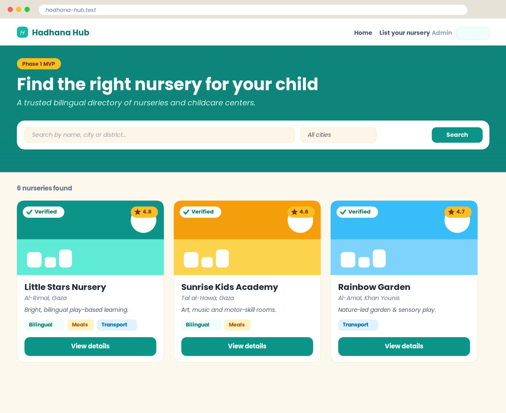
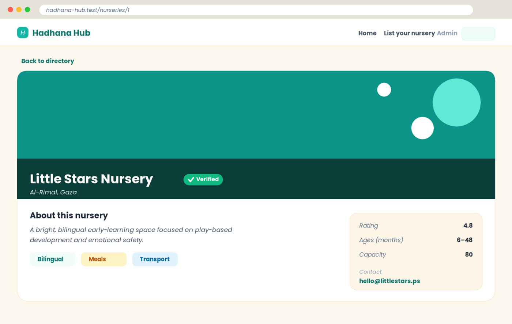
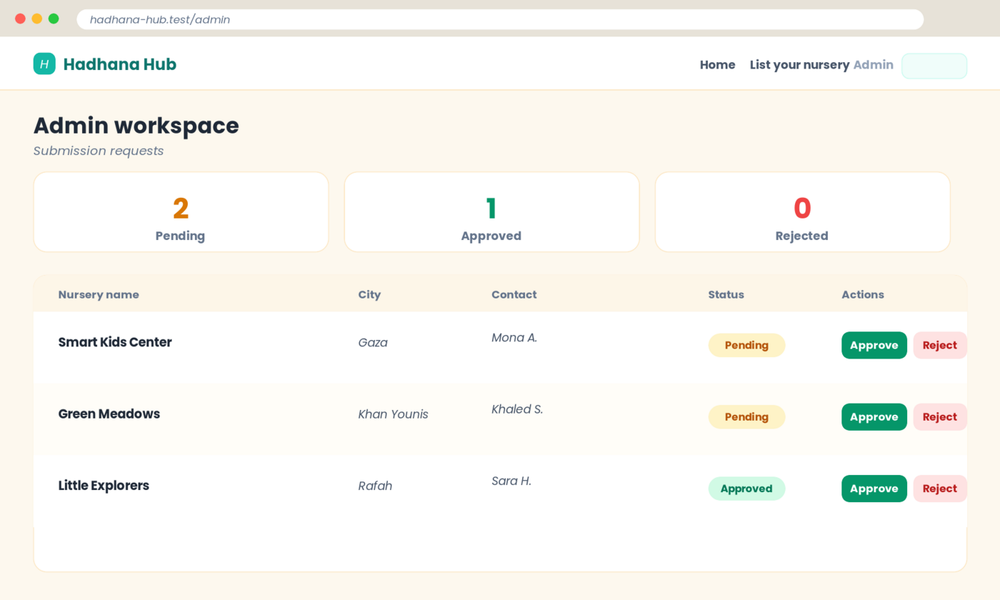

# 🧸 Hadhana Hub — Bilingual Nursery Directory

> A trusted **bilingual (Arabic / English)** directory connecting families with nurseries and childcare centers. **Phase 1 MVP.**
>
> دليل موثوق **ثنائي اللغة (عربي / إنجليزي)** يربط العائلات بالحضانات ومراكز رعاية الأطفال — المرحلة الأولى (نموذج أولي).

<p>
  
  
  
  
  
</p>

---

## ✨ Overview

Hadhana Hub is a quality-assessment directory for early-childhood care. Parents can search and
filter nurseries, view detailed profiles, and nursery owners can submit a registration request that
admins review and approve. The interface is fully bilingual with proper **RTL / LTR** handling.

This repository is a focused **Phase 1 MVP** — clean, modular, documented, and built on a stack that
scales: **Laravel 11 + PostgreSQL + Tailwind CSS**.

---

## 🖼️ UI Preview

> The screenshots below preview the implemented Blade views (English / LTR). The same screens render
> right-to-left in Arabic via the in-app language switcher. Card and profile images load real photos
> from each nursery's `image_url` at runtime.

### Directory & search


### Nursery profile


### Admin workspace


---

## 🚀 Features

- **Bilingual directory (AR / EN)** with full **RTL/LTR** layout switching and a one-click language toggle.
- **Searchable & filterable** listing — free-text search across bilingual names, city, and district, plus city and "verified only" filters.
- **Nursery profiles** — photo, rating, age range, capacity, amenities (bilingual / meals / transport), and contact details.
- **Registration workflow** — multi-field, **server-side validated** submission form for nursery owners.
- **Admin workspace** — review queue with pending / approved / rejected stats and one-click approve/reject.
- **Security by default** — strict validation rules and parameterized queries via Eloquent (mitigates SQL injection).
- **Scalable foundation** — modular controllers, models, migrations, and seeders ready for Phase 2.

---

## 🧱 Tech Stack

| Layer        | Choice                                   |
|--------------|------------------------------------------|
| Framework    | Laravel 11 (PHP 8.2+)                     |
| Database     | PostgreSQL 16                            |
| Views        | Blade templates                          |
| Styling      | Tailwind CSS (CDN — no build step needed) |
| i18n         | Laravel localization (`lang/ar.json`, `lang/en.json`) + RTL middleware |
| Testing      | PHPUnit (feature tests)                   |

---

## ⚙️ Getting Started

### Requirements
- PHP **8.2+**
- Composer
- PostgreSQL **13+**

### Installation

```bash
# 1. Clone
git clone https://github.com/<your-username>/hadhana-hub.git
cd hadhana-hub

# 2. Install PHP dependencies
composer install

# 3. Environment
cp .env.example .env
php artisan key:generate

# 4. Configure your PostgreSQL credentials in .env
#    DB_CONNECTION=pgsql
#    DB_DATABASE=hadhana_hub
#    DB_USERNAME=postgres
#    DB_PASSWORD=postgres

# 5. Create the database (once)
createdb hadhana_hub   # or: CREATE DATABASE hadhana_hub; in psql

# 6. Migrate & seed sample data
php artisan migrate --seed

# 7. Run
php artisan serve
```

Then open **http://localhost:8000**.

| Route             | Description                          |
|-------------------|--------------------------------------|
| `/`               | Public directory (search + filter)   |
| `/nurseries/{id}` | Nursery profile                      |
| `/submit`         | Register-your-nursery form           |
| `/admin`          | Admin review workspace               |
| `/lang/ar` `/lang/en` | Switch language (RTL / LTR)      |

---

## 🌍 Localization & RTL

The active locale is resolved by `App\Http\Middleware\SetLocale` (session-driven, Arabic by default).
Switching language updates both the translation strings and the document direction:

```blade
<html lang="{{ app()->getLocale() }}" dir="{{ $isRtl ? 'rtl' : 'ltr' }}">
```

Translations live in `lang/ar.json` and `lang/en.json`. The Arabic UI uses the **Cairo** typeface;
English uses **Poppins**. Logical CSS properties (`start` / `end`) keep the layout correct in both directions.

---

## 🔐 Security Notes

- **Server-side validation** on every write (`SubmissionController@store`).
- **Parameterized queries** through Eloquent / the query builder — no raw string interpolation.
- **CSRF protection** on all forms (`@csrf`).
- Mass-assignment guarded via explicit `$fillable` on each model.

---

## 🧪 Testing

```bash
php artisan test
```

Feature tests cover the directory listing, search filtering, and submission creation
(`tests/Feature/DirectoryTest.php`). Tests run against an in-memory SQLite database (see `phpunit.xml`),
so no PostgreSQL instance is required for CI.

---

## 🗂️ Project Structure

```
app/
├── Http/Controllers/        # Nursery, Submission, Admin/Dashboard
├── Http/Middleware/         # SetLocale (locale + RTL)
└── Models/                  # Nursery, Submission
database/
├── migrations/              # nurseries, submissions (+ framework tables)
└── seeders/                 # sample nurseries & submissions
lang/                        # ar.json, en.json
resources/views/             # layout, home, nursery profile, form, admin
routes/web.php
```

---

## 🛣️ Roadmap (Phase 2)

- 🗺️ Interactive **map view** with multi-attribute, geo-based filtering
- 🔐 Authenticated admin with roles & audit log
- 📸 Image uploads + media storage
- ⭐ Parent reviews & verified-rating system
- 🌐 Additional locales and full API layer for mobile

---

## 📄 License

Released under the [MIT License](LICENSE).
